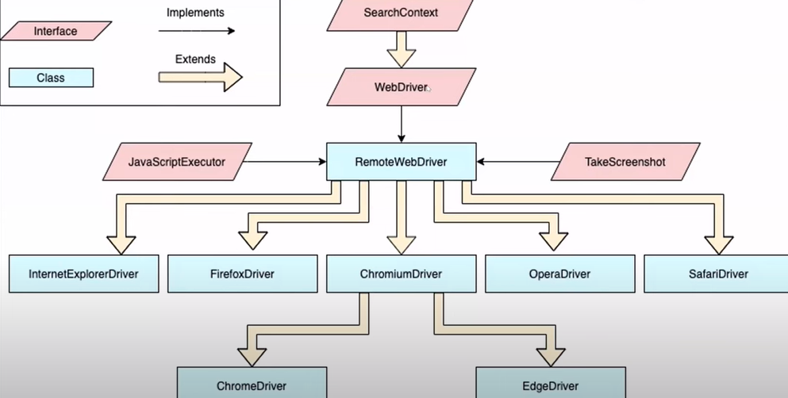
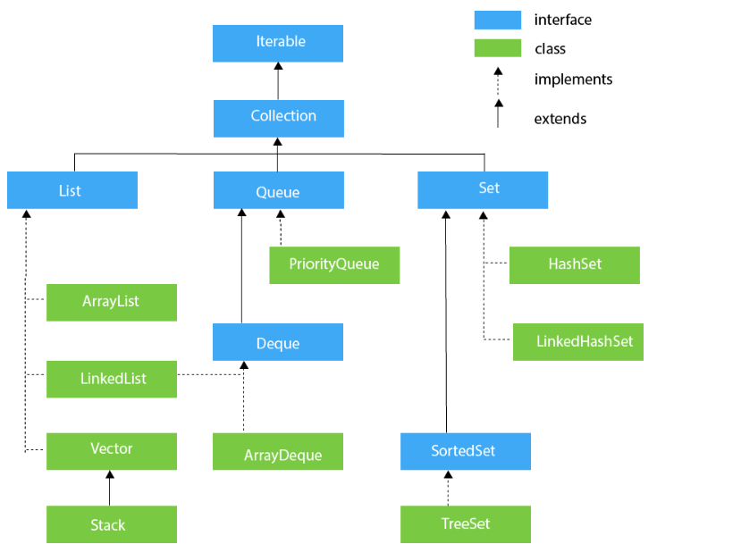
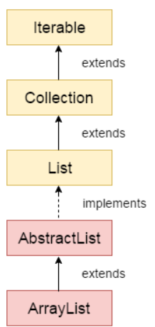

# Selenium-Java

Selenium WebDriver: Selenium Webdriver is a component in selenium, is a java interface. Webdriver is an API(Application Programming Interface).

WebDriver(Interface) -> RemoteWebDriver -> ChromeDriver, FirefoxDriver, EdgeDriver, etc.

Frontent (Presentation Layer) -> Application/Business Logic Layer(API) -> Database layer

Create Maven project
All maven dependencies available on https://mvnrepository.com/ add the required dependencies in pom.xml

Note: After adding dependencies in pom.xml -> update the project

Webdriver dependencies:
1) Selenium Java: https://mvnrepository.com/artifact/org.seleniumhq.selenium/selenium-java/4.20.0

Interface: is group of related methods with empty bodies. Its class responsibility to implement methods declared in the interface. When class agreed to implement interface, they must need to provide implementation/bodies to all defined methods in interface.

# Selenium WebDriver Interface: 
https://www.selenium.dev/selenium/docs/api/java/org/openqa/selenium/WebDriver.html

Create an object of clss to access the methods:
1) ChromeDriver driver = new ChromeDriver();
driver object -> has access to all methods of Chrome Driver

2) WebDriver driver = new ChromeDriver();
driver object -> has access to the methods of Chrome Driver which are defined in web driver interface

ChromeDriver: https://getwebdriver.com/chromedriver#stable

EdgeDriver: https://developer.microsoft.com/en-us/microsoft-edge/tools/webdriver?form=MA13LH 

GekoDriver(Firefox): https://github.com/mozilla/geckodriver/releases

# Difference between driver.close & driver.quit: 
driver.close: is associated only with current window. driver.quit: is associate will all the windows

array.length method used for normal/single array
array.size method used for ArrayList, eg: ArrayList<String>

# link text has tag anchor tag 'a'.
We always prefer linkText() over partialLinkText().
partialLinkText() is prefered when we hve a single link on the page.

•	TagName & Class: used for group of webelements

•	findElement(): returns a particlar/single webelement

•	findElements(): returns a group/multiple webelement => Variable type used List or Set. Return Type: List.
List Element allows duplicates. Set doesn't allow diplicates.

•	To find total elements in list use size() method.

findElement() - single webelement

findElements() - multiple webelement

Scenario 1: Locator matching with single webelement.

•	findElement(loc) -> single webelement; Return type: WebElement
•	findElements(loc) -> single webelement; Return type: List<WebElement>

Scenario 2: Locator matching with multiple webelement.

•	findElement(loc) -> single webelement; Return type: WebElement
•	findElements(loc) -> multiple webelement; Return type: List<WebElement>

Scenario 3: Locator is not matching with any element/s.

•	findElement(loc) -> No Such Element Exception.
•	findElements(loc) -> will not throw any exception. Returns 0. // this will create empty list collection if there are no elements.

# CSS Selector
 
 tag id -> tag#id
 
 tag class -> tag#class
 
 tag attribute -> tag[attribute="value"]
 
 tag class attribute -> tag.class[attribute="value"]

# XPath 
XPath is an address of the element and is based on DOM - Document Object Model

Types of XPath:
1) Absolute XPath(Full xpath) => Ex: /html/body/header/div/div/div[2]/div/input
2) Relative XPath(partial xpath) => Ex: //*[@id="search"]/input

Differences between Absolute & Relative XPaths?
1)	Absolute XPath starts with / -> represents root node.
Relative XPath starts with //

2)	Absolute XPath does not use attributes.
Relative XPath works with attribute.

3)	Absolute XPath traverse through each node till it find element.
Relative XPath directly jumps & finds the element by using attribute.

Relative XPath:
Syntax:
•	//tagname[@attribute=’value’]
•	//*[@attribute=’value’]
Ex: //*[@title='MacBook'] or //img[@title='MacBook']

XPath with single attribute => Ex: //input[@placeholder='Search']

XPath with multiple attribute => Ex: //input[@name='search'][@placeholder='Search']

link text can be inner text but all inner text can't be link text

//<a href="https://xyz.com">Click Me</a> =>
linktext=yes; inner text=yes

welcome

linktext=no; inner text=yes

xpath with contains() => Ex: //input[contains(@placeholder,'Sea')]

handling dynamic attributes => 
• //*[@id='start' or @id='stop']
• //*[contains(@id,'st')]
• //*[starts-with(@id,'st')]

Chained XPath => Combination of Absolute & Relative XPath. Ex: //div[@id='logo']/a/img

Locating a parent element:
Syntax:
1)	//<knownXpath>/parent::*
2)	//<knownXpath>/parent::element
3)	//<knownXpath>/..

Ex:
1)	//input[@id=’txtUsername’]/parent::form
2)	//input[@id=’txtUsername’]/parent::*
3)	//input[@id=’txtUsername’]/..

•	Dropdown box:
1.	Select dropdown
2.	Bootstrap dropdown
3.	Hidden dropdown

•	Web Tables:
1.	Static Web Table
2.	Dynamic Web table
3.	Table with Pagination

•	Remote Webdriver implements 3 interfaces:
1. WebDriver interface
2. JavaScript interface
3. TakesScreenshot interface

JavaScript methods: exexuteScript() - used in place of sendKeys(), click(); element intercepted exception.

1. WebDriver driver = new ChromeDriver();  //upcasting
JavascriptExecutor js = (JavascriptExecutor)driver;

2. ChromeDriver driver = new ChromeDriver();
JavascriptExecutor js = driver; // no need of typecasting we can directly assign it to driver

Using get & setAttribute
Ex:
		js.executeScript("arguments[0].setAttribute('value','John')", inputbox);

Scrolling:
1. scroll down page by pixel number: js.executeScript("window.scrollBy(0,1500)", "")
2. scroll the page till element is visible: js.executeScript("arguments[0].scrollIntoView();", ele);
3. scroll page till end of the page: js.executeScript("window.scrollBy(0,document.body.scrollHeight)");
4. scrolling up to initial position: js.executeScript("window.scrollBy(0, -document.body.scrollHeight)");
 
Zoom In/Out:
Ex:

JavascriptExecutor js = (JavascriptExecutor)driver;
		js.executeScript("document.body.style.zoom='50%'");

Upload Files:
1. Single file

driver.findElement(By.xpath("//input[@id='filesToUpload']")).sendKeys("D:\\Automation\\Selenium BDD\\Selenium-Java\\Test1.txt");
		
		if(driver.findElement(By.xpath("//ul[@id='fileList']//li")).getText().equals("Test1.txt")) {
			System.out.println("File is successfully uploaded");
		}
2. Multiple file

		String file1 = "D:\\Automation\\Selenium BDD\\Selenium-Java\\Test1.txt";
		String file2 = "D:\\Automation\\Selenium BDD\\Selenium-Java\\Test2.txt";
		
		driver.findElement(By.xpath("//input[@id='filesToUpload']")).sendKeys(file1+"\n"+file2);
        int noOfFilesUploaded = driver.findElements(By.xpath("//ul[@id='fileList']//li")).size();

Revert git changes: git revert "commit id"
Eg: git revert 36e4b6e6eaf63ffd2cd2d99c3636e96b3bb7b9eb

Headless mode (without UI): ChomeOptions class

# ChromeOptions:
1) Headless Testing:

ChromeOptions options = new ChromeOptions();
		options.addArguments("--headless=new");  // setting for headless mode of execution
		WebDriver driver = new ChromeDriver(options);

2) SSL Handling:

ChromeOptions options = new ChromeOptions();
		options.setAcceptInsecureCerts(true); // accepts SSL certificates
		WebDriver driver = new ChromeDriver(options);

3) Remove "Chrome" is controlled by automated test software:

ChromeOptions options = new ChromeOptions();
		options.setExperimentalOption("excludeSwitches", new String[] {"enable-automation"});
		
		WebDriver driver = new ChromeDriver(options);
		
4) To run test in incognito mode

ChromeOptions options = new ChromeOptions();
		options.addArguments("--incognito");

## Java
# Collection Framework

java.util package contains all the classes and interfaces for the Collection framework.

• Iterable Interface: root interface for all the collection classes.
Iterator<T> iterator()  

• Collection Interface: Collection interface builds the foundation on which the collection framework depends. Methods of Collection interface are Boolean add ( Object obj), Boolean addAll ( Collection c), void clear(), etc. which are implemented by all the subclasses of Collection interface.

• List Interface: List interface is the child interface of Collection interface. It inhibits a list type data structure in which we can store the ordered collection of objects. It can have duplicate values. List interface is implemented by the classes ArrayList, LinkedList, Vector, and Stack.
List <data-type> list1= new ArrayList();  
List <data-type> list2 = new LinkedList();  
List <data-type> list3 = new Vector();  
List <data-type> list4 = new Stack(); 

• ArrayList: ArrayList class implements List interface. ArrayList class maintains the insertion order and is non-synchronized. The elements stored in the ArrayList class can be randomly accessed

• LinkedList: LinkedList implements Collection interface. Uses doubly linked list internally to store duplicate elements. It maintains the insertion order and is not synchronized. In LinkedList, the manipulation is fast because no shifting is required. 

• Vector: uses Dynamic array to store data elements. It is similar to ArrayList, it is synchronized & contain's many methods that are not part of collection framework.

• Stack: is the subclass of Vector. It implements 'last-in-first-out' data stucture. It contatins methods of vector and also provides methods like boolean push(), boolean peek(), boolean push(object o).

• Queue Interface: it maintaince 'first-in-first-out' order. Also defined as ordered list. There are various classes like PriorityQueue, Deque & ArrayDeque.
Queue<String> q1 = new PriorityQueue();  
Queue<String> q2 = new ArrayDeque();  

• Priority Queue: implements Queue interface. It holds elements/objects as per priorities. PriorityQueue doesn't allow null vale.

• Deque interface: it extends Queue interface. We can remove & add the elements from both the side. Deque stands for double-ended queue which emables us to perform operations on both the ends.
Deque d = new ArrayDeque();

• ArrayDeque: ArrayDeque class implements Deque interface. We can add/delete the elements from both the ends. It is faster than ArrayList & Stack & has no capacity restrictions.

• Set Interface: present in java.util package, it extends Collection interface. It represents unordered set of elements which doesn't allow us to store duplicate items. Set is implemented by HashSet, linkedHashSet & TreeSet.
Set<data-type> s1 = new HashSet<data-type>();  
Set<data-type> s2 = new LinkedHashSet<data-type>();  
Set<data-type> s3 = new TreeSet<data-type>();  

• HashSet: HashSet class implements Set Interface. It represents collection that uses hash table for storage. Hashing is used to store elements in HashSet. It contains unique items.

• LinkedHashSet: LinkedHashSet calss represnts LinkedList implementation of Set Interface. It extends HashSet class & implements Set interface. It contains unique elements. It maintains the insertion order & permits null elements.

• SortedSet Interface: is alternate of Set interface, provides total ordering on its elements. The elements of SortedSet are arranged in increasing/ascending oreder. 
SortedSet<data-type> set = new TreeSet();

• TreeSet: TreeSet class implements the Set interface that uses tree for storage. Similar to HashSet, TreeSet contains unique elements. Access & retrieval time of TreeSet is quite fast. Elements are stored in ascending oreder.

